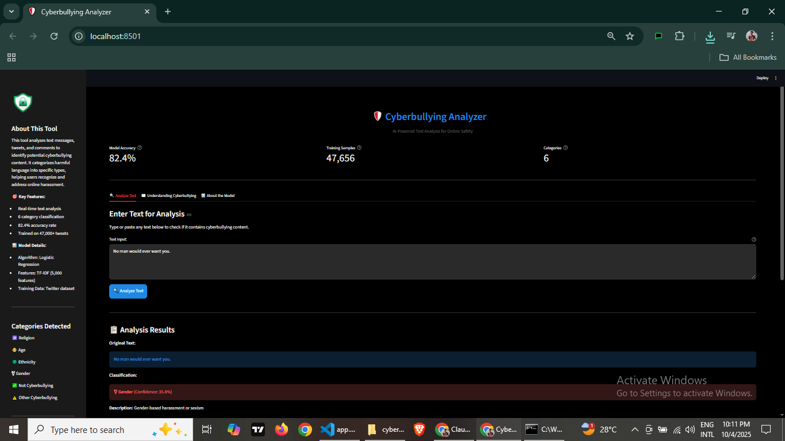
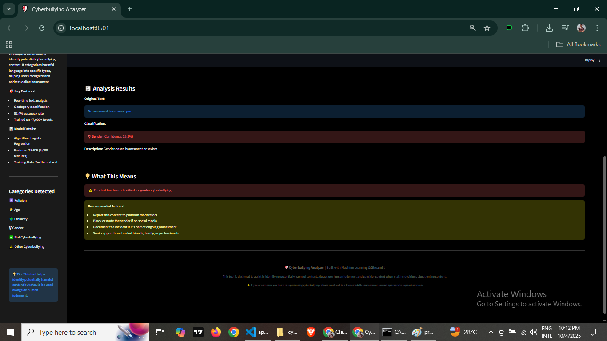
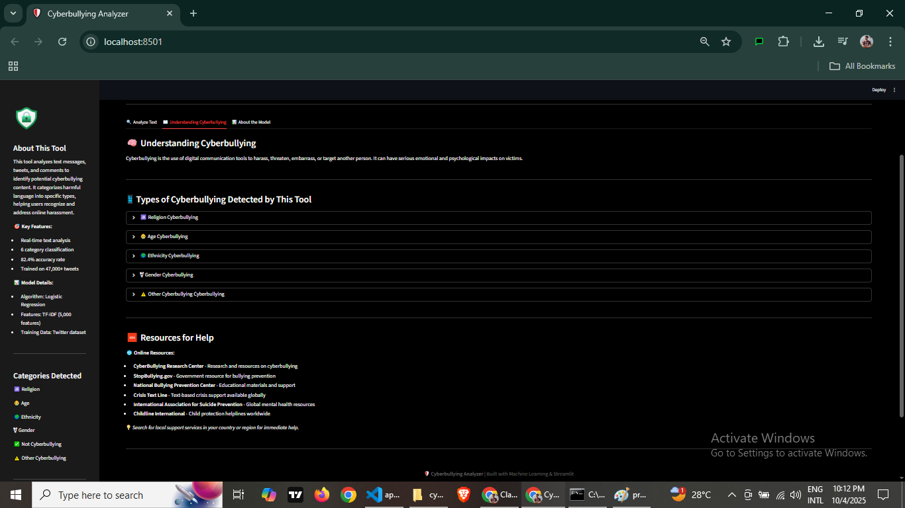
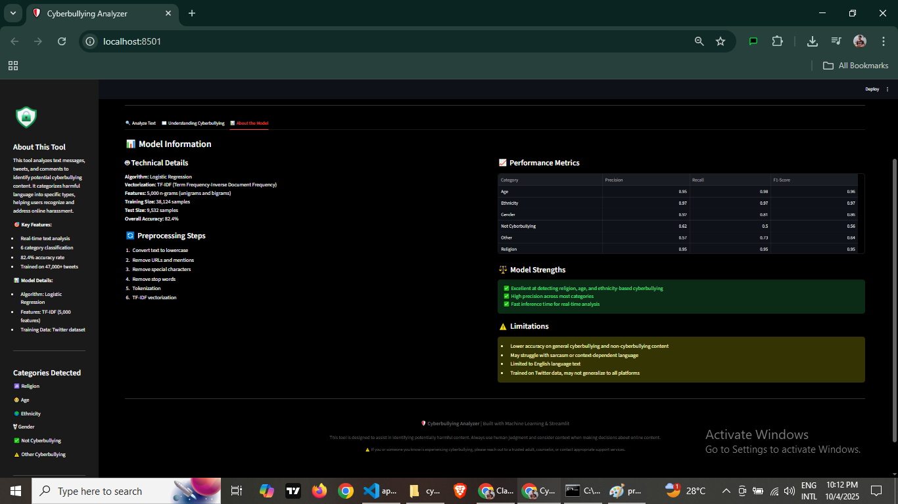

# 🛡️ Cyberbullying Analyzer


An **NLP-based cyberbullying detection system** that achieves **82.4% accuracy** across 6 harassment categories. This project features real-time text classification using **Logistic Regression** and **TF-IDF vectorization** to help create safer online spaces.

---

## 🚀 Live Demo

🔗 https://cyberbullying-analyzer.streamlit.app/

Experience the cyberbullying analyzer in action! No installation required.

---

## 🌟 Features

- **Real-time Text Analysis** - Instantly classify text messages, tweets, and comments
- **6 Category Detection** - Identifies religion, age, ethnicity, gender-based harassment, and more
- **High Accuracy** - 82.4% overall accuracy on test dataset
- **Interactive Web Interface** - User-friendly Streamlit dashboard with educational content
- **Comprehensive Documentation** - Detailed Jupyter notebook with full analysis

---

## 🎯 Categories Detected

| Category | Description | Icon |
|----------|-------------|------|
| **Religion** | Religious-based harassment or discrimination | 🕉️ |
| **Age** | Age-based discrimination or bullying | 👶 |
| **Ethnicity** | Ethnic or racial harassment | 🌍 |
| **Gender** | Gender-based harassment or sexism | ⚧️ |
| **Other Cyberbullying** | General harassment or bullying | ⚠️ |
| **Not Cyberbullying** | Safe, non-harmful content | ✅ |

---

## 📊 Model Performance

| Metric | Score |
|--------|-------|
| **Overall Accuracy** | 82.4% |
| **Training Samples** | 38,124 |
| **Test Samples** | 9,532 |
| **Features** | 5,000 (TF-IDF) |

### Performance by Category

| Category | Precision | Recall | F1-Score |
|----------|-----------|--------|----------|
| Age | 0.95 | 0.98 | 0.96 |
| Ethnicity | 0.97 | 0.97 | 0.97 |
| Gender | 0.92 | 0.81 | 0.86 |
| Not Cyberbullying | 0.62 | 0.50 | 0.56 |
| Other Cyberbullying | 0.57 | 0.73 | 0.64 |
| Religion | 0.95 | 0.95 | 0.95 |

---

## 🛠️ Tech Stack

- **Language**: Python 3.8+
- **ML Framework**: Scikit-learn
- **NLP**: NLTK, TF-IDF Vectorization
- **Web Framework**: Streamlit
- **Data Processing**: Pandas, NumPy
- **Visualization**: Matplotlib, Seaborn

---

## 📁 Project Structure

```
cyberbullying-analyzer/
│
├── images/                          # Screenshots and media
│   ├── preview1.png
│   ├── preview2.png
│   ├── preview3.png
│   └── preview4.png
│
├── app.py                          # Streamlit web application
├── preprocess.py                   # Text preprocessing utilities
├── cyberbullying_analyzer.ipynb    # Jupyter notebook (full analysis)
├── cyberbullying_tweets.csv        # Training dataset (47K+ tweets)
│
├── cyberbullying_lr_model.pkl      # Trained Logistic Regression model
├── tfidf_vectorizer.pkl            # TF-IDF vectorizer
├── label_encoder.pkl               # Label encoder for categories
│
├── requirements.txt                 # Python dependencies
└── README.md                        # Project documentation
```

---

## 🔧 Installation & Setup

### Prerequisites
- Python 3.8 or higher
- pip package manager

### Step 1: Clone the Repository
```bash
git clone https://github.com/adeel-iqbal/cyberbullying-analyzer.git
cd cyberbullying-analyzer
```

### Step 2: Create Virtual Environment (Optional but Recommended)
```bash
# Windows
python -m venv venv
venv\Scripts\activate

# macOS/Linux
python3 -m venv venv
source venv/bin/activate
```

### Step 3: Install Dependencies
```bash
pip install -r requirements.txt
```

### Step 4: Download NLTK Data
```python
python -c "import nltk; nltk.download('stopwords')"
```

### Step 5: Run the Application
```bash
streamlit run app.py
```

The app will open in your default browser at `http://localhost:8501`

---

## 💻 Usage

### Web Interface
1. Launch the Streamlit app using `streamlit run app.py`
2. Enter text in the input area
3. Click "Analyze Text" button
4. View the classification results and confidence score

### Python API
```python
import joblib
from preprocess import clean_tweet

# Load models
model = joblib.load("cyberbullying_lr_model.pkl")
vectorizer = joblib.load("tfidf_vectorizer.pkl")
label_encoder = joblib.load("label_encoder.pkl")

# Analyze text
text = "Your text here"
cleaned_text = clean_tweet(text)
X_vec = vectorizer.transform([cleaned_text])
prediction = model.predict(X_vec)[0]
category = label_encoder.inverse_transform([prediction])[0]

print(f"Category: {category}")
```

---

## 📸 Screenshots

### Main Interface


### Analysis Results


### Educational Content


### Model Performance


---

## 🧪 Model Training Pipeline

1. **Data Collection**: 47,692 tweets labeled across 6 categories
2. **Text Preprocessing**:
   - Lowercase conversion
   - URL and mention removal
   - Special character removal
   - Stopword removal
   - Tokenization
3. **Feature Engineering**: TF-IDF vectorization (5,000 features, unigrams + bigrams)
4. **Model Training**: Logistic Regression with 80-20 train-test split
5. **Evaluation**: Classification metrics and confusion matrix analysis

See `cyberbullying_analyzer.ipynb` for detailed analysis.

---

## 📝 Requirements

```txt
streamlit>=1.28.0
pandas>=1.5.0
numpy>=1.23.0
scikit-learn>=1.2.0
nltk>=3.8
joblib>=1.3.0
matplotlib>=3.7.0
seaborn>=0.12.0
```

---

## 🤝 Contributing

Contributions are welcome! Here's how you can help:

1. Fork the repository
2. Create a feature branch (`git checkout -b feature/AmazingFeature`)
3. Commit your changes (`git commit -m 'Add some AmazingFeature'`)
4. Push to the branch (`git push origin feature/AmazingFeature`)
5. Open a Pull Request

---

## 🐛 Known Limitations

- Model trained primarily on Twitter data (may not generalize to all platforms)
- Limited to English language text
- Lower accuracy on general cyberbullying and non-cyberbullying categories
- May struggle with sarcasm or context-dependent language

---

## 🔮 Future Enhancements

- [ ] Multi-language support
- [ ] Deep learning models (BERT, RoBERTa)
- [ ] Real-time social media integration
- [ ] Severity scoring system
- [ ] API endpoint deployment
- [ ] Mobile application
- [ ] Context-aware detection

---

## 👤 Author

**Adeel Iqbal**

- GitHub: [@adeel-iqbal](https://github.com/adeel-iqbal)
- LinkedIn: [adeeliqbalmemon](https://linkedin.com/in/adeeliqbalmemon)
- Email: adeelmemon096@yahoo.com

---

## ⭐ Show Your Support

If you find this project helpful, please consider giving it a ⭐ on GitHub!

---

<div align="center">
  <p>Made with ❤️ and Python</p>
  <p>© 2024 Adeel Iqbal. All rights reserved.</p>
</div>
